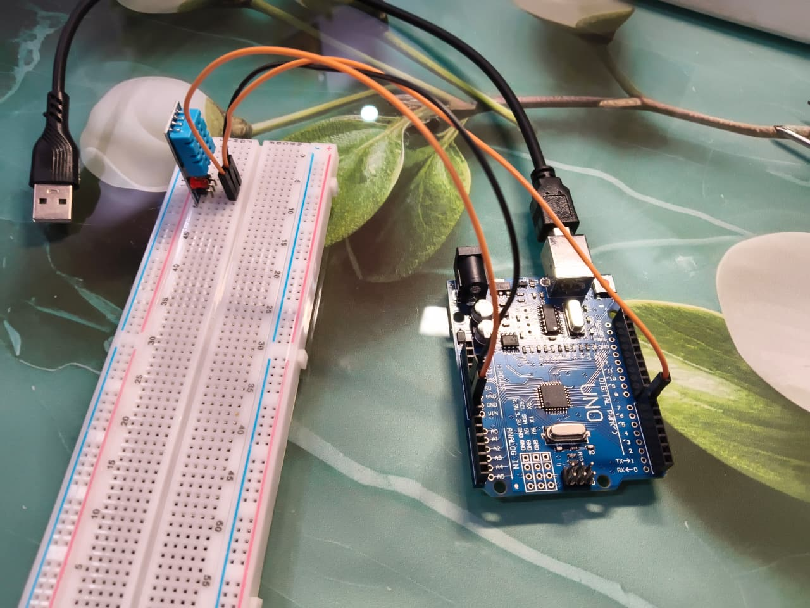
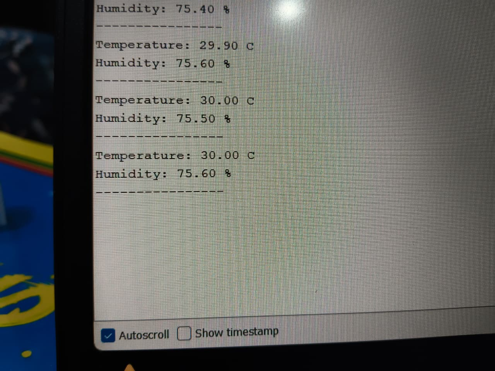
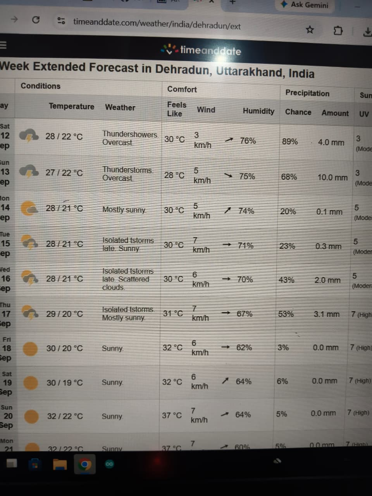

# Arduino DHT11 Temperature & Humidity Monitor

A simple Arduino project that measures the **temperature and humidity of the surrounding environment using a DHT11 sensor**.

I built this project to understand how Arduino communicates with digital sensors and how sensor data can be displayed in real time using the Serial Monitor.

## Project Overview

The DHT11 sensor measures two values:

* Temperature in °C
* Relative humidity in %

The Arduino reads the sensor every two seconds and sends the values to the Serial Monitor.

The program also checks whether the sensor reading has failed before displaying the result.

## Components Used

* Arduino Uno
* DHT11 Temperature and Humidity Sensor
* Breadboard
* Jumper wires
* USB cable
* Computer with Arduino IDE

## Circuit Connections

| DHT11 | Arduino       |
| ----- | ------------- |
| VCC   | 5V            |
| DATA  | Digital Pin 7 |
| GND   | GND           |

## Circuit Diagram



## How It Works

1. The DHT11 sensor measures the surrounding temperature and humidity.
2. Arduino reads the sensor through digital pin 7.
3. The program checks whether the reading is valid.
4. Temperature and humidity values are sent through Serial Communication.
5. The results are shown on the Arduino Serial Monitor.
6. A new reading is taken every two seconds.

## Arduino Code

The project uses the **DHT sensor library**.

```cpp
#include <DHT.h>

#define DHTPIN 7
#define DHTTYPE DHT11

DHT dht(DHTPIN, DHTTYPE);

void setup() {
  Serial.begin(9600);
  dht.begin();

  Serial.println("DHT11 Started");
}

void loop() {

  float temperature = dht.readTemperature();
  float humidity = dht.readHumidity();

  if (isnan(temperature) || isnan(humidity)) {
    Serial.println("DHT11 reading failed!");
    delay(2000);
    return;
  }

  Serial.print("Temperature: ");
  Serial.print(temperature);
  Serial.println(" C");

  Serial.print("Humidity: ");
  Serial.print(humidity);
  Serial.println(" %");

  Serial.println("----------------");

  delay(2000);
}
```

## Result

The Arduino successfully reads temperature and humidity from the DHT11 sensor and displays both values on the Serial Monitor.



## Project Proof

Here is the working hardware setup:



## Project Explanation

A short video of the project is also included in this repository.

[Watch the project explanation](Explanation.mp4)

## What I Learned

While working on this project, I learned:

* How the DHT11 sensor works
* How to connect a digital sensor with Arduino
* How Arduino libraries are used
* How to read sensor values through code
* How to use Serial Monitor for real-time data
* How to detect failed sensor readings
* Basic debugging of Arduino hardware and code

## Possible Future Improvements

I would like to improve this project by adding:

* LCD or OLED display
* Multiple environmental sensors
* Data logging
* ESP32 Wi-Fi support
* Web dashboard
* Temperature and humidity graphs
* Alerts when temperature crosses a set value

These improvements could turn the project into a small environmental monitoring station.

## Tools & Technologies

* Arduino Uno
* DHT11
* Arduino IDE
* C/C++
* Serial Communication

## Author

**Suraj Rawat**

Student interested in **Robotics, Mechatronics, Automation and Embedded Systems**.

This project is part of my learning journey in Arduino, electronics and embedded systems.

## License

This project is available under the **MIT License**.
